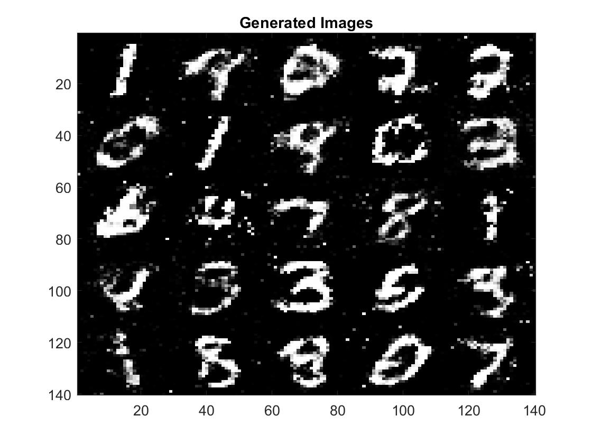
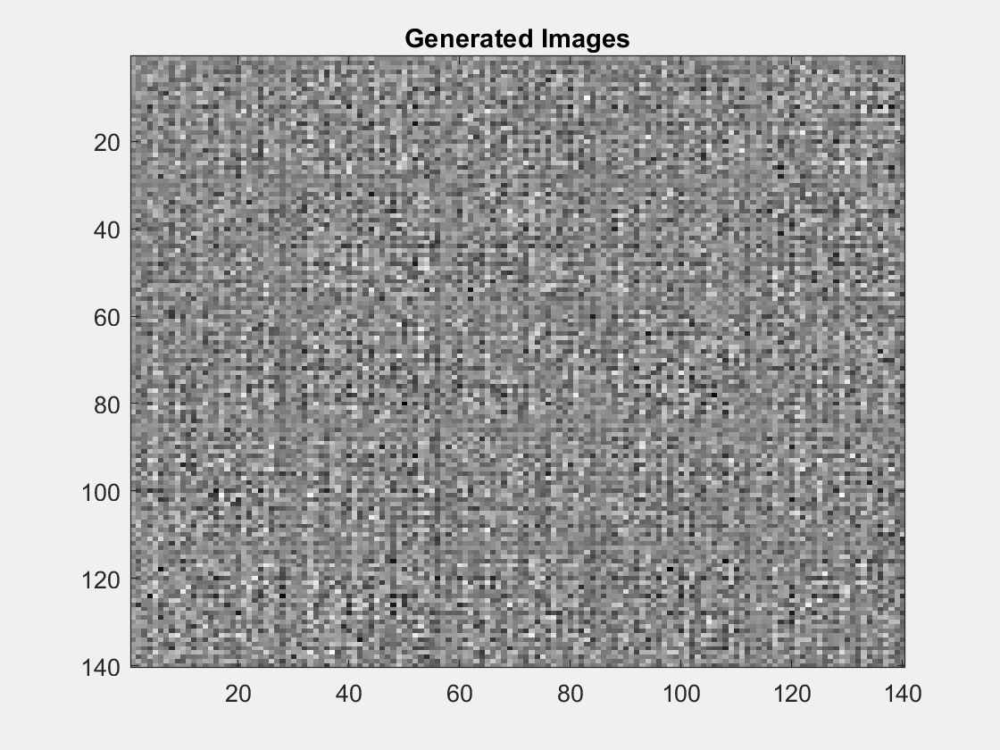
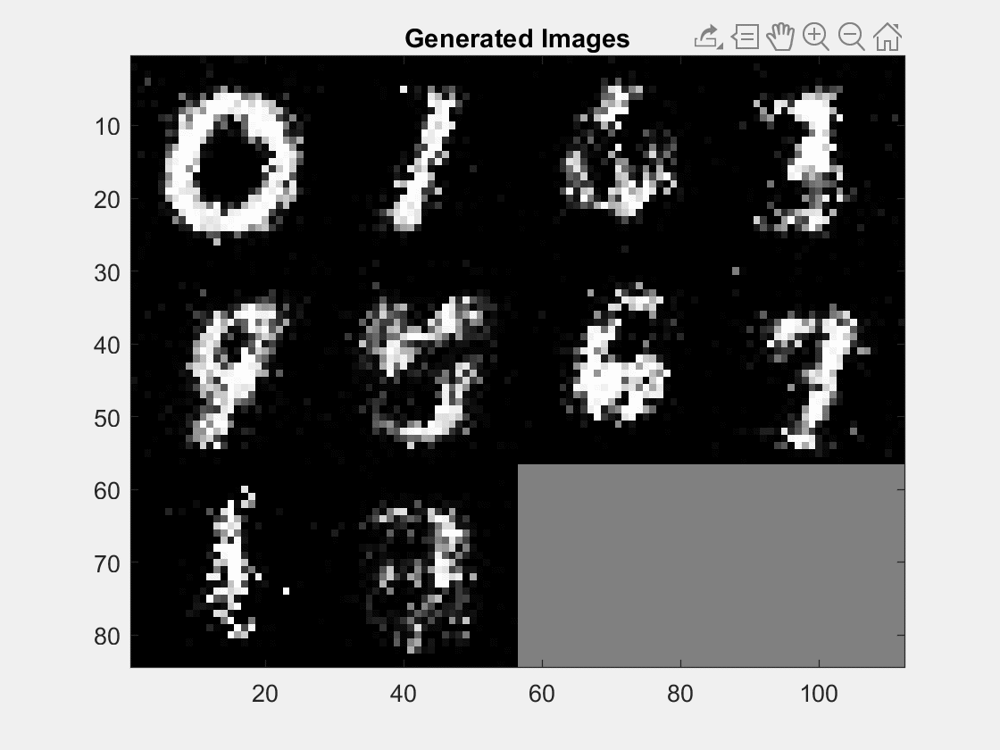
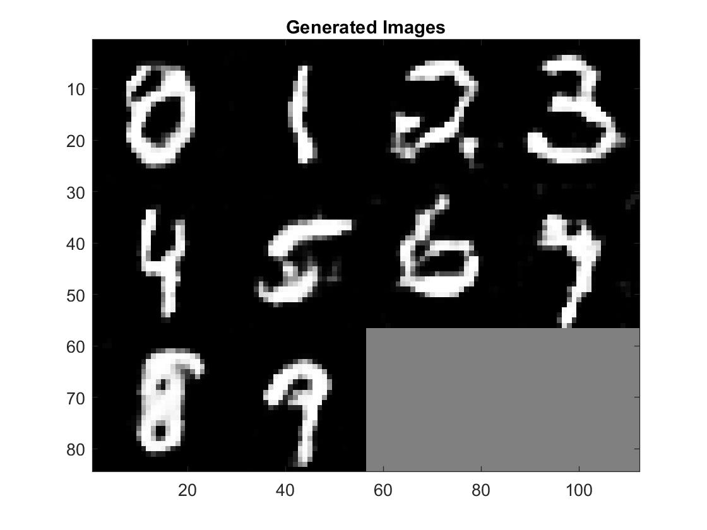
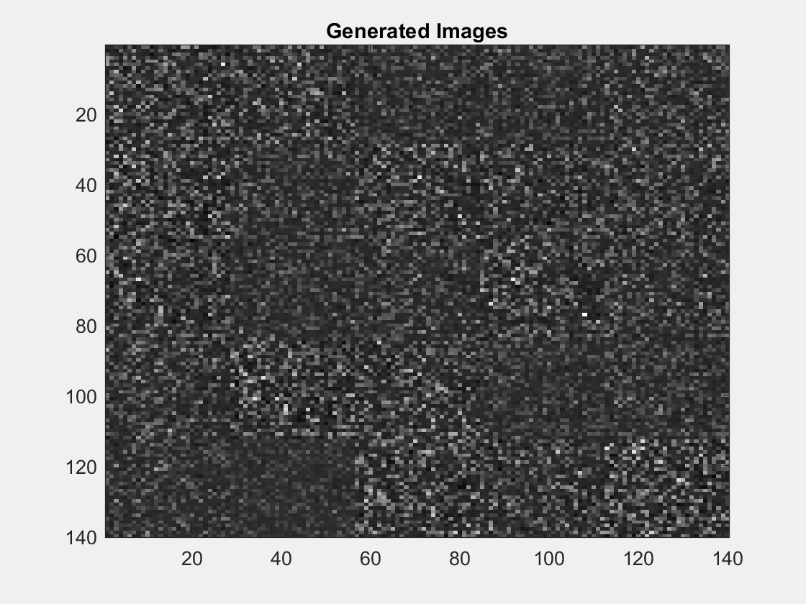
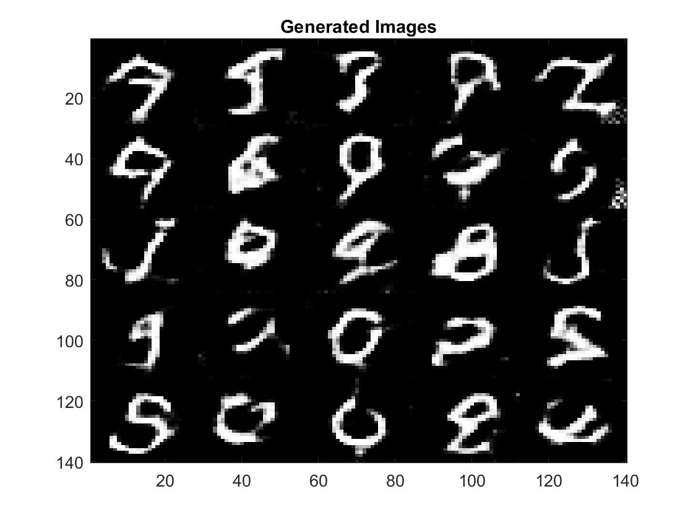
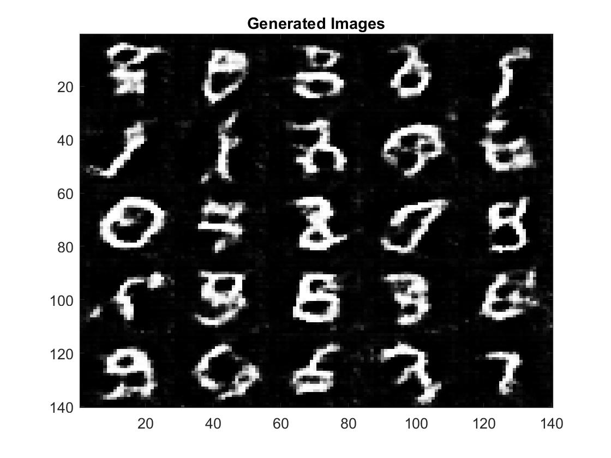

# Matlab-GAN  
Collection of MATLAB implementations of Generative Adversarial Networks (GANs) suggested in research papers. This repository is greatly inspired by eriklindernoren's repositories [Keras-GAN](https://github.com/eriklindernoren/Keras-GAN) and [PyTorch-GAN](https://github.com/eriklindernoren/PyTorch-GAN), and contains codes to investigate different architectures of GAN models. 

## Configuration
To run the following codes, users should have the following packages,
- MATLAB 2019b
- Deep Learning Toolbox
- Parallel Computing Toolbox (optional for GPU usage)

## Datasets
- [Facade Dataset](http://cmp.felk.cvut.cz/~tylecr1/facade/)
- [Apple2Orange Dataset](http://www.image-net.org/)
- [CelebA Dataset](http://mmlab.ie.cuhk.edu.hk/projects/CelebA.html)
- [Mnist Dataset](http://yann.lecun.com/exdb/mnist/)

## Table of Contents
+ **G**enerative **A**dversarial **N**etwork (GAN) [[code]](https://github.com/zcemycl/Matlab-GAN/blob/master/GAN/GAN.m) [[paper]](https://arxiv.org/abs/1406.2661) 
+ **L**east **S**quares **G**enerative **A**dversarial **N**etwork (LSGAN) [[code]](https://github.com/zcemycl/Matlab-GAN/blob/master/LSGAN/LSGAN.m) [[paper]](https://arxiv.org/abs/1611.04076)
+ **D**eep **C**onvolutional **G**enerative **A**dversarial **N**etwork (DCGAN) [[code]](https://github.com/zcemycl/Matlab-GAN/blob/master/DCGAN/DCGAN.m) [[paper]](https://arxiv.org/abs/1511.06434)
+ **C**onditional **G**enerative **A**dversarial **N**etwork (CGAN) [[code]](https://github.com/zcemycl/Matlab-GAN/blob/master/CGAN/CGAN.m) [[paper]](https://arxiv.org/abs/1611.06430)
+ **A**uxiliary **C**lassifier **G**enerative **A**dversarial **N**etwork (ACGAN) [[code]](https://github.com/zcemycl/Matlab-GAN/blob/master/ACGAN/ACGAN.m) [[paper]](https://arxiv.org/abs/1610.09585)
+ InfoGAN [[code]](https://github.com/zcemycl/Matlab-GAN/blob/master/InfoGAN/InfoGAN.m) [[paper]](https://arxiv.org/abs/1606.03657)
+ **A**dversarial **A**uto**E**ncoder (AAE) [[code]](https://github.com/zcemycl/Matlab-GAN/blob/master/AAE/AAE.m) [[paper]](https://arxiv.org/abs/1511.05644)
+ Pix2Pix [[code]](https://github.com/zcemycl/Matlab-GAN/blob/master/Pix2Pix/PIX2PIX.m) [[paper]](https://arxiv.org/abs/1611.07004)
+ **W**asserstein **G**enerative **A**dversarial **N**etwork (WGAN) [[code]](https://github.com/zcemycl/Matlab-GAN/blob/master/WGAN/WGAN.m) [[paper]](https://arxiv.org/abs/1701.07875)
+ **S**emi-Supervised **G**enerative **A**dversarial **N**etwork (SGAN) [[code]](https://github.com/zcemycl/Matlab-GAN/blob/master/SGAN/SGAN.m) [[paper]](https://arxiv.org/abs/1606.01583)
+ CycleGAN [[code]](https://github.com/zcemycl/Matlab-GAN/blob/master/CycleGAN/CycleGAN.m) [[paper]](https://arxiv.org/abs/1703.10593)
+ DiscoGAN [[paper]](https://arxiv.org/abs/1703.05192)

## Outputs
GAN  -Generator, Discriminator|  LSGAN  -Least Squares Loss | DCGAN  -Deep Convolutional Layer | CGAN  -Condition Embedding
:-------------------------:|:-------------------------:|:-------------------------:|:-------------------------:
 |||
ACGAN  -Classification|InfoGAN mnist  -Continuous, Discrete Codes|AAE  -Encoder, Decoder, Discriminator|Pix2Pix  -Pair and Segments checking  -Decovolution and Skip Connections
 |||
WGAN |SGAN|CycleGAN  -Instance Normalization  -Mutli-agent Learning|InfoGAN CelebA
|||

## References
- Y. LeCun and C. Cortes, “MNIST handwritten digitdatabase,” 2010. [MNIST]
- J. Deng, W. Dong, R. Socher, L.-J. Li, K. Li, andL. Fei-Fei, “ImageNet: A Large-Scale Hierarchical Image Database,” inCVPR09, 2009. [Apple2Orange (ImageNet)]
- R. Tyleček and R. Šára, “Spatial pattern templates forrecognition of objects with regular structure,” inProc.GCPR, (Saarbrucken, Germany), 2013. [Facade]
- Z. Liu, P. Luo, X. Wang, and X. Tang, “Deep learn-ing face attributes in the wild,” inProceedings of In-ternational Conference on Computer Vision (ICCV),December 2015. [CelebA]
- Goodfellow, Ian J. et al. “Generative Adversarial Networks.” ArXiv abs/1406.2661 (2014): n. pag. (GAN)
- Radford, Alec et al. “Unsupervised Representation Learning with Deep Convolutional Generative Adversarial Networks.” CoRR abs/1511.06434 (2015): n. pag. (DCGAN)
- Denton, Emily L. et al. “Semi-Supervised Learning with Context-Conditional Generative Adversarial Networks.” ArXiv abs/1611.06430 (2017): n. pag. (CGAN)
- Odena, Augustus et al. “Conditional Image Synthesis with Auxiliary Classifier GANs.” ICML (2016). (ACGAN)
- Chen, Xi et al. “InfoGAN: Interpretable Representation Learning by Information Maximizing Generative Adversarial Nets.” NIPS (2016). (InfoGAN)
- Makhzani, Alireza et al. “Adversarial Autoencoders.” ArXiv abs/1511.05644 (2015): n. pag. (AAE)
- Isola, Phillip et al. “Image-to-Image Translation with Conditional Adversarial Networks.” 2017 IEEE Conference on Computer Vision and Pattern Recognition (CVPR) (2016): 5967-5976. (Pix2Pix)
- J.-Y. Zhu, T. Park, P. Isola, and A. A. Efros, “Unpairedimage-to-image translation using cycle-consistent ad-versarial networks,” 2017. (CycleGAN)
- Arjovsky, Martín et al. “Wasserstein GAN.” ArXiv abs/1701.07875 (2017): n. pag. (WGAN)
- Odena, Augustus. “Semi-Supervised Learning with Generative Adversarial Networks.” ArXiv abs/1606.01583 (2016): n. pag. (SGAN)
